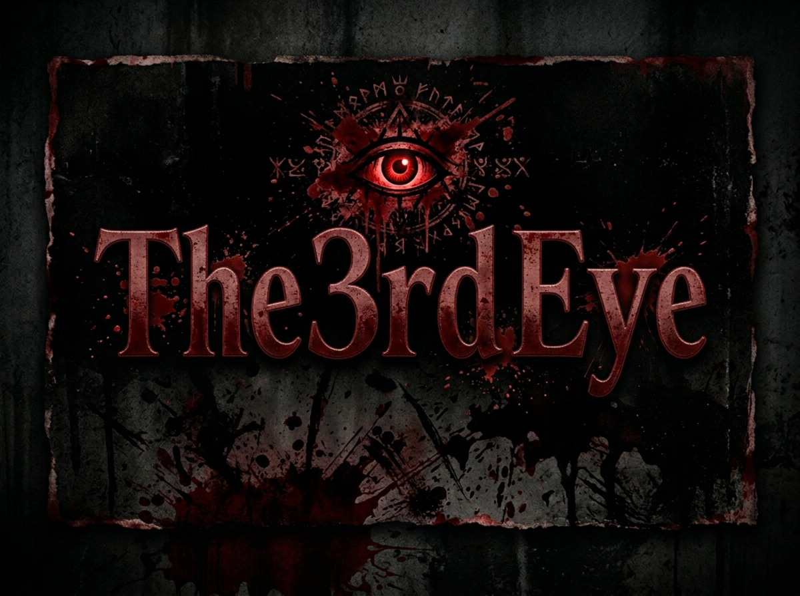

# The3rdEye
Snap camera shots from a target's phone or PC webcam with nothing more than a link.


# What is The3rdEye?
<p>The3rdEye spins up a decoy webpage on an integrated PHP server and punches it out to the internet using Localhost, CloudFlare Tunnel, or Localhost.run. You send the generated link to a target; if they grant camera access, their photo is captured instantly. A built-in GPS locator can also pull their physical coordinates during the session.</p>

## How It Works
<p>The tool chains three components into a single automated workflow:</p>
<ul>
  <li><b>Hosting</b> – A lightweight PHP server delivers the bait page locally.</li>
  <li><b>Tunnel Generation</b> – The local port is exposed via multiple supported tunnel providers for public access.</li>
  <li><b>Data Harvesting</b> – Upon user interaction and permission grant, camera frames and geolocation data are saved to disk.</li>
</ul>

## Features
<p>3 ready-made engagement templates are bundled. <b>New ones can be requested by opening an issue.</b></p>
<ul>
  <li>1] coming soon</li>
  <li>2] coming soon</li>
  <li>3] coming soon</li>
</ul>
<p>A cleanup script is provided to wipe all captures, logs, and temporary files after use.</p>

## Tunnel Options
<ul>
  <li>Localhost</li>
  <li>Cloudflare</li>
  <li>Localhost.run</li>
</ul>

## Platforms Tested on
<ul>
  <li>Termux</li>
  <li>Kali Linux</li>
  <li>Ubuntu</li>
</ul>

# Installation & Requirements

```
apt-get -y install php wget unzip
```

## Clone & Run (Kali Linux/Termux):

```
git clone https://github.com/r4tur1/The3rdEye
cd The3rdEye
bash the3rdeye.sh
```

## Clean Up:

```
bash cleanup.sh
```
<p>This removes all captured photos and saved location data.</p>


### Disclaimer
<p>The3rdEye is built for authorized penetration testing only. Misuse is on the user, not the developer.</p>
```
